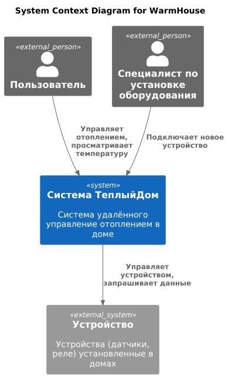

# Project_template

Развитие экосистемы ТеплыйДом -> SaaS УмныйДом

# Задание 1. Анализ и планирование

_Прежде чем проектировать новую систему, необходимо досконально разобраться с тем, что есть. Вам нужно изучить текущее монолитное приложение, понять его сильные и слабые стороны, а также проанализировать, как принципы Domain-Driven Design (DDD) могут быть применены для построения новой архитектуры._

### 1. Описание функциональности монолитного приложения

**Управление отоплением:**

- Пользователи могут удалённо включать/выключать отопление в своих домах.
- Система управляет датчиками, установленными в домах.

**Мониторинг температуры:**

- Пользователи могут просматривать текущую температуру в своих домах через веб-интерфейс.
- Система запрашивает данные о температуре у датчиков, установленных в домах. 
- Система выводит данные о температуре в веб-интерфейсе.

**Управление устройствами:**
- Специалист по установке подключает новое оборудование

### 2. Анализ архитектуры монолитного приложения

- Язык программирования: Go
- База данных: PostgreSQL
- Архитектура: Монолитная, все компоненты системы (обработка запросов, бизнес-логика, работа с данными) находятся в рамках одного приложения.
- Взаимодействие: Синхронное, запросы обрабатываются последовательно.

### 3. Определение доменов и границы контекстов

Система удалённого управление отоплением в доме.
- Домен Управление устройствами
- Домен Управление аккаунтами пользователей
- Домен Телеметрия
  - Поддомен Сбор показаний датчиков
  - Поддомен Аналитика и отчетность

### **4. Проблемы монолитного решения**

- Масштабируемость: ограничена, так как монолит сложно масштабировать по частям. При увеличении числа пользователей и устройств, в первую очередь, потребуется отмасштабировать узел Телеметрии.
- Разработка: высокий риск ошибок из-за высокой связанности кода; необходимость тестирования всего приложения.
- Развертывание: требует остановки всего приложения.

### 5. Визуализация контекста системы — диаграмма С4



# Задание 2. Проектирование микросервисной архитектуры

_Вы провели анализ текущего монолитного приложения, определили его функциональные блоки и выделили основные домены. Теперь ваша задача — спроектировать высокоуровневую архитектуру новой экосистемы, основанную на микросервисах. Для этого вам нужно определить ключевые микросервисы, спроектировать их взаимодействие, а также визуализировать полученную архитектуру с помощью диаграмм C4._

**Диаграмма контейнеров (Containers)**

[Диаграмма контейнеров (plantuml link)](https://www.plantuml.com/plantuml/uml/hLXRQnj757xNhzYeVP30jcWfVJ3umPP3sc9JDN8U2WKnsXrBI_QYxexiY528xRffIQXfAHJQKZTDeQ_oHNXza__2x3_gERExadOr8wze0YRMZFPytxbzvwmVc8vkTGtQzIojpLZ7NwvKFBAxr39Pkzli-jJJNOTHXotfhbtfMCHXNTjQz9bXcSrAzQF56XuzsToesCHdr8EZHXMU8AP3lQKEVBTGU63GRVYekJwfmK4EdAf7_3OrRDCnAWd0ejkXZa_rhcUo7l7qjicepheU_N3HX6Vzc43XGUnH0bUfkhRjEX6NgSidW5mXbgMutZHzVSPr7JYChmkhXl7GeZPuiKLQfU8sqOb1YmlQ-yrMrRLSRwNuthP1wCSVuDas-1kVDYsYFosMiy_xpFL8InZmswH3LnwxNSUWnfhxh8wVI-L9qvRPQhFwqzwQrQKP-xiOgsdx1c44GZ-F_I-fPRcxQlgFgPKrRK7gwwndKMr5MnTftO2JKhbSADIevxjEu-4pLi8AMD2A_9WF-NNucb_0_wUy7-xp0Nu6GqN1imFPfoj5I4037saqqTjoeTw3tDl2aa5tJ9sYhRVXNhWVlW1Bb_WRs1iMvUVz1OtVmEVpy81Vyq0B3yH5dzyA6jT0ufRVXg_uGEEd6Z-7qniWTvYbvCDl3OT2f9fkrskxhf7cjcCQr6sqNP-PJWkf_Cm3i3RWmyNma0y5Q01GPuBdd_m4eFlXIq5Ze8M7G1ev1KWo_84FilYwvNOHiZ1gmSOQvfHulP9l4u-rNOXQmnUC0A9EI5tZRy4PTEuozgnOrfuNDFWtibBoEmI_Nbj5Of-H7UBhdjbXnSY70JzPHDwOhV15-2qSG6Gr_ZkmZCYVyQ76VmFo9yA_0GPNutVIP1-XLuoqV2YOf8VA6Jvw5vh31lTiK_TSA8GuvzNuNDkSE4UMZrp1zG-0lyBKXtj85L0380fPlnEXJL8TX4TATX2iO8fFL7HPDklYz1rmYUenNR9I7enYVpElbwMobLpCnuR_ZKx3pmtc38w3cQ2kHJfgvCytLcjpmcErzqMrOsDSGMlcOkGpZnAO7gqicNfoCIUFqwHFLPad7RFH8epkajuuyQkrJxL7qU44n3zGItlWrJcsspLMsYdKM1yGX0H5pIDoB5A_5rNYENX_7Vu8_PHeqSr8gAOBGoi1o84eMUpA07eImzSFlrFKqmAYeCC34V5C2QBk0GduuX2i32CDx4SymiEoj67JSLflZdlMQ4vswZgE2kAB9DH06LiUzR-sHAH-uhyesX23D8cQZCho56gS7u4Pf-KUnEdWv4FAj850p1J_9FBOmvn5FZS99Y6nfIAH6t4694py5DoMsp5rX5ZT_A8MZJIiNr5bv-7hL15fGljcHJxPAPGvXitH9euHquYJNRMD-tbSHGCTk9pB4Ryf562rYRUKQ1Zol-3fCvI7A5um-0umTkZ5Ip7Xhi83QAjhCVu2eUJxyEMZXPJ6mq297v8sClPbB4UuSKIPmJjyQ1m_RD0WBLE2iA2g6fQmO4GzF-O-Q-WjQo9WOvSJDK7aaPT0-28Ma25gLoh5Q0sYWgjBj1AeDu3Y9rjRDN1Zv8Lyn4fyK8LoMIQaGjgYBKziAHdw4FOxz1UrKwwQM3gtGbxFu7uK59a7ok7CVqqaD_nUbTwHxgKRT0Q8R1Yha38I51xanbEEMXNKL8qc2xjqaaAdxayrIxhkJsCwikUpsiIFeKXmgnPEIgAy9oqVJQL4AbnrLAJ-f6Phv5LELceAKb7a_ueKnwa8-CLyRetVhQHkJCXe-0hRgdy_ltnLC-f3Y95iJCIbf52wzER1tq2qurUfYFbNiGwXSCjQBn5qr8dBM204cq2jOAdYpl2HfsQwD8M_GtuYz39-Axc_4ALO-JsN2ffqrKnyLEdQLFFbBxwPAlO_x4f3zAxjoONiZNX3FXG1l8tVjzkKMAojjwdu-qc-M8xtklaBUL_wxZH7mCURRIxmd6CbMLOKeZdrLvDZsPjAFYr5hFy0)

**Диаграмма компонентов (Components)**

Добавьте диаграмму для каждого из выделенных микросервисов.

**Диаграмма кода (Code)**

Добавьте одну диаграмму или несколько.

# Задание 3. Разработка ER-диаграммы

_К началу этого подзадания вы определили ключевые микросервисы и спроектировали их взаимодействие. А ещё визуализировали полученную архитектуру с помощью диаграмм C4, что позволило вам получить чёткое представление о структуре и взаимодействиях в системе.
Необходимо определить ключевые сущности и смоделировать их взаимосвязи, чтобы создать логическую модель базы данных._

**Device Database**
[ER-диаграмма (plantuml link)](https://www.plantuml.com/plantuml/uml/hLJBJiCm4BpdAwmUA-K7KDKB227WLZX7stX5NM8xifsAgkNVyRF43gbw82TxTtOzivvOVpBHWm9EEYRG77iaKfcTh2eKXfaZMRnhL0i2cWnsGKuLiT_IhHj6oHqH0z_QUFNzM_601zQYhw5-cQh2BgjRhJvGe0A3TBtsgBhEm8vIKV7u4g7BJhPWc1Ip04kJGTV4J8A471o0TR1bdINTQ0Dcq1QnbRBpUOgwLQntxMtOu9VnOGV4k9zeVhDaHxez-K9ygIVJB80ZcJP_ZJ9zwwGvzPsPGJdMfWdmdRHtDpUlaUOfYoTNwIdu7kdylnhE7JwnpUXie5IXrgDHNsMpQL60Oj8Jqd6JEANzVypaqepSIYruuLvo3e8-oq49wCQkQ4EcsOTKOP0oU_klCYSWThJ9lPOYcd-mF_diNL1xY67S-Pnni9RdlHCuTlNvNDVo52LL_cs88J_DAdWaXf97ysWQR7MnTDuqFXvPi1nFTl8Cv7A1rs4_)

# Задание 4. Создание и документирование API реализуем RestAPI эндпоинтыэндпоинты
### 1. Тип API

- Для взаимодействия SPA с микросервисами реализуем RestAPI эндпоинты.
- Данные телеметрии будем обрабатывать асинхронно, в связи с потенциально большим количеством подключенных устройств.
- Команды на устройства также будем передавать асинхронно, так как есть требование пользовательских сценариев работы Умного дома, а значит возможна автоматизированная отправка команд с потенциально высокой частотой.
- Также добавим синхронное взаимодействие между DeviceMicroservice и DeviceApiGateway для критических в плане скорости операций.

### 2. Документация API

[DeviceMicroservice RestAPI](schemas/api/device_microservice.yaml)
[DeviceAPIGateway RestAPI](schemas/api/device_api_gateway.yaml)
[SmartHouse AsyncAPI](schemas/api/smarthouse_async_api.yaml)

# Задание 5. Работа с docker и docker-compose

Перейдите в apps.

Там находится приложение-монолит для работы с датчиками температуры. В README.md описано как запустить решение.

Вам нужно:

1) сделать простое приложение temperature-api на любом удобном для вас языке программирования, которое при запросе /temperature?location= будет отдавать рандомное значение температуры.

Locations - название комнаты, sensorId - идентификатор названия комнаты

```
	// If no location is provided, use a default based on sensor ID
	if location == "" {
		switch sensorID {
		case "1":
			location = "Living Room"
		case "2":
			location = "Bedroom"
		case "3":
			location = "Kitchen"
		default:
			location = "Unknown"
		}
	}

	// If no sensor ID is provided, generate one based on location
	if sensorID == "" {
		switch location {
		case "Living Room":
			sensorID = "1"
		case "Bedroom":
			sensorID = "2"
		case "Kitchen":
			sensorID = "3"
		default:
			sensorID = "0"
		}
	}
```

2) Приложение следует упаковать в Docker и добавить в docker-compose. Порт по умолчанию должен быть 8081

3) Кроме того для smart_home приложения требуется база данных - добавьте в docker-compose файл настройки для запуска postgres с указанием скрипта инициализации ./smart_home/init.sql

Для проверки можно использовать Postman коллекцию smarthome-api.postman_collection.json и вызвать:

- Create Sensor
- Get All Sensors

Должно при каждом вызове отображаться разное значение температуры

Ревьюер будет проверять точно так же.


# **Задание 6. Разработка MVP**

Необходимо создать новые микросервисы и обеспечить их интеграции с существующим монолитом для плавного перехода к микросервисной архитектуре. 

### **Что нужно сделать**

1. Создайте новые микросервисы для управления телеметрией и устройствами (с простейшей логикой), которые будут интегрированы с существующим монолитным приложением. Каждый микросервис на своем ООП языке.
2. Обеспечьте взаимодействие между микросервисами и монолитом (при желании с помощью брокера сообщений), чтобы постепенно перенести функциональность из монолита в микросервисы. 

В результате у вас должны быть созданы Dockerfiles и docker-compose для запуска микросервисов. 