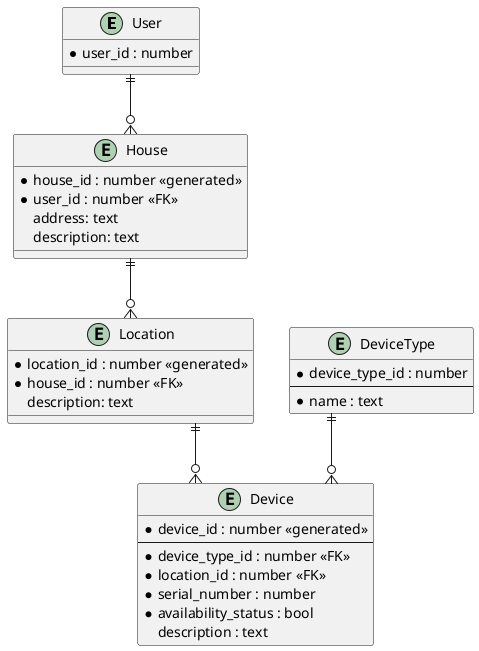

[Назад](../../README.md)

```puml
@startuml
skinparam linetype ortho

entity "User" as user {
    *user_id : number 
}

entity "Device" as device {
    *device_id : number <<generated>>
    --
    *device_type_id : number <<FK>>
    *location_id : number <<FK>>
    *serial_number : number
    *availability_status : bool 
    description : text
}

entity "DeviceType" as device_type {
    *device_type_id : number
    --
    *name : text
}

entity "Location" as location {
    *location_id : number <<generated>>
    *house_id : number <<FK>>
    description: text
}

entity "House" as house {
    *house_id : number <<generated>>
    *user_id : number <<FK>>
    address: text
    description: text
}

device_type ||--o{ device
user ||--o{ house
house ||--o{ location
location ||--o{ device

@enduml

```